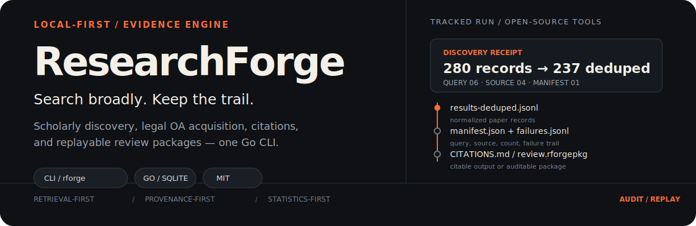
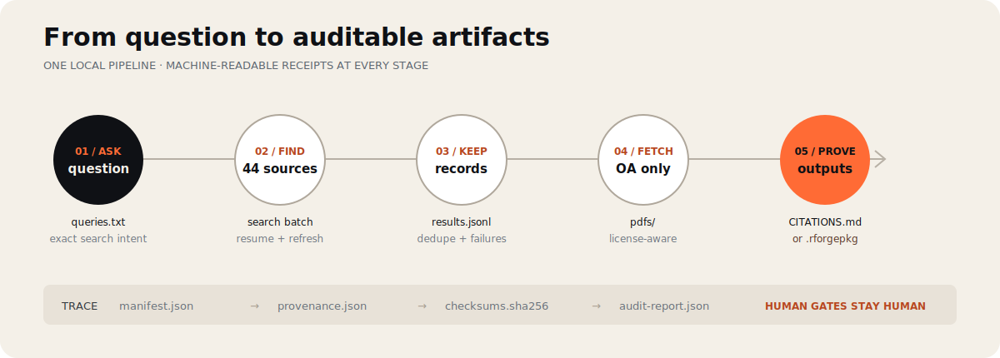

<p align="center">
  
</p>

<p align="center">
  <a href="https://github.com/TrebuchetDynamics/research-forge/actions/workflows/ci.yml"></a>
  <a href="https://github.com/TrebuchetDynamics/research-forge/actions/workflows/playwright-e2e.yml"></a>
  <a href="https://pkg.go.dev/github.com/TrebuchetDynamics/research-forge"></a>
  <a href="./LICENSE"></a>
</p>

**ResearchForge** is a local-first research CLI. It searches scholarly sources, normalizes records, downloads legal open-access files, builds citations, and preserves the query and failure trail needed to audit the work later.

Use a research directory for literature scouting. Use a guided `forge` project when screening, extraction, analysis, and package replay must be attributable.

## See the proof first

One `search batch` creates a directory you can inspect with ordinary tools:

```text
research/my-topic/
├── manifest.json           # exact queries, sources, counts, timestamp
├── results.jsonl           # normalized records from successful sources
├── results-deduped.jsonl   # merged DOI/title identities
├── failures.jsonl          # retryable source/query failures
├── search-stats.txt        # coverage and dedupe summary
├── raw/                    # one readable file per successful source/query
└── pdfs/                   # approved open-access downloads
```

The hero receipt comes from this repository's tracked [`open-source-project-search`](./research/open-source-project-search/manifest.json) run: 6 queries, 4 sources, 280 records, and 237 deduplicated records. It is project evidence, not an adoption or performance claim.

## Start in three commands

```sh
curl -fsSL \
  https://raw.githubusercontent.com/TrebuchetDynamics/research-forge/main/install.sh | bash

rforge search batch --out ./research/my-topic \
  --query "prediction markets information aggregation" \
  --sources openalex,arxiv --stats

rforge oa fetch --dir ./research/my-topic
rforge citations build --research-dir ./research
```

You now have machine-readable records, a failure queue, optional PDFs, and `research/CITATIONS.md`. Prebuilt Linux, macOS, and Windows binaries are also on the [releases page](https://github.com/TrebuchetDynamics/research-forge/releases); source installs require Go 1.26+:

```sh
go install github.com/TrebuchetDynamics/research-forge/cmd/rforge@latest
```

## How the evidence trail works

<p align="center">
  
</p>

ResearchForge automates reversible work—retrieval, normalization, dedupe, queue preparation, and trace audits. Humans still approve inclusion/exclusion, full-text acquisition, accepted extraction, analysis methods, final claims, and package export.

## Keep a topic alive

Put one query per line in `queries.txt`, then search several sources in one transaction:

```sh
rforge search batch --out ./research/market-design \
  --queries queries.txt \
  --sources openalex,arxiv,crossref,semantic-scholar \
  --continue-on-error --stats
```

Preview failed-query retries without spending a network request:

```sh
rforge search resume \
  --failures ./research/market-design/failures.jsonl \
  --out ./research/market-design --dry-run
```

Re-run the stored manifest instead of copying the topic to `-v2` or `-next-wave`:

```sh
rforge search refresh --dir ./research/market-design --dry-run
rforge search refresh --dir ./research/market-design
# reports new / unchanged / gone DOIs
```

Before finishing agent-authored research, validate its versioned receipt:

```sh
rforge provenance validate ./research/market-design/provenance.json
```

Schema v1 enforces an exact depth (`quick`, `standard`, or `comprehensive`), normalized `rforge_version` data, required fields, and string-only errors.

## When scouting becomes a review

Create a reproducible review project when decisions and analysis must be replayable by another reviewer:

```sh
rforge project create ./my-review --title "High entropy superconductors"

rforge forge init --project ./my-review \
  --question "What outcomes are reported for high entropy superconductors?"

rforge forge status --project ./my-review
rforge forge next --project ./my-review
```

The guided state machine covers source planning, import and dedupe, legal acquisition, parser arbitration, screening, evidence extraction, analysis, reporting, privacy review, and export. Review packages include checksums, provenance, redaction records, and offline audit/replay commands:

```sh
rforge package audit  ./review.rforgepkg
rforge package replay ./review.rforgepkg
```

See the [reproducible review package specification](./docs/reproducible-review-package.md) for required files and human gates.

## Source coverage

`search batch` supports **44 connectors**. Start small; broad sweeps are slower and more exposed to upstream quotas.

| Preset | Good for |
|---|---|
| `openalex,arxiv` | Fast general discovery |
| `scholarly-fast` | OpenAlex + arXiv + Crossref |
| `openalex,arxiv,semantic-scholar` | Citation-oriented AI/CS research |
| `biomedical` | PubMed, Europe PMC, bioRxiv |
| `preprints` | arXiv, bioRxiv, medRxiv, ChemRxiv |
| `open` | Open-access sources |
| `all` | Maximum breadth; expect partial failures |

Run `rforge doctor` before a large sweep. It surfaces optional source configuration such as `RFORGE_SEMANTIC_SCHOLAR_API_KEY`, whose absence can cause HTTP 429 responses.

## Use it from an agent

The repository includes a retrieval-first skill at [`skills/research-forge/SKILL.md`](./skills/research-forge/SKILL.md):

```sh
mkdir -p ~/.claude/skills/research-forge
curl -fsSL \
  https://raw.githubusercontent.com/TrebuchetDynamics/research-forge/main/skills/research-forge/SKILL.md \
  > ~/.claude/skills/research-forge/SKILL.md
```

Then ask: `Use the research-forge skill to research: <your question>`.

The skill defines source breadth, provenance requirements, legal-acquisition boundaries, and human approval gates. It does not authorize an agent to approve screening, extraction, final claims, or package export.

## Trust boundaries

- **Open access is explicit.** `oa fetch` reports `oa_unavailable` separately from download failures.
- **Upstream failures stay visible.** Rate limits and timeouts remain in `failures.jsonl`; `resume` and `refresh` are deliberate retries.
- **Research claims remain human-owned.** Retrieval and checks can be automated; scientific approval cannot.
- **Shareable packages are reviewed.** Secrets, private paths, and restricted full text are blocked or redacted before export.
- **The local web UI is optional.** Core workflows remain available through the CLI and machine-readable files.

## Develop

```sh
git clone https://github.com/TrebuchetDynamics/research-forge.git
cd research-forge
make check
```

ResearchForge uses Go, SQLite, a Go + HTMX local UI, deterministic fixtures, and test-first development. Start with [CONTRIBUTING.md](./CONTRIBUTING.md), [SKILLS.md](./SKILLS.md), and the [product requirements](./RESEARCH-FORGE-PRD.md).

## Decision-gated scope

The local Go + HTMX UI is tracked in issue #2 and ADR 0006. The MIT license decision is tracked in issue #1 and [docs/owner-decisions.md](docs/owner-decisions.md).

Run `make todo-audit` to verify owner decisions, `make todo-completion-audit` for the closeout checklist, or `make decisions-markdown` for a blocker table.

## License

MIT License (SPDX: `MIT`), Copyright © 2026 Trebuchet Dynamics. See [LICENSE](LICENSE).
