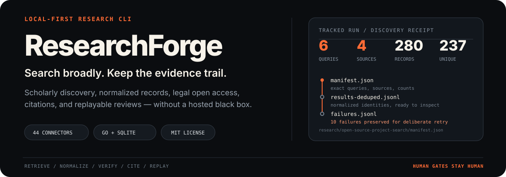
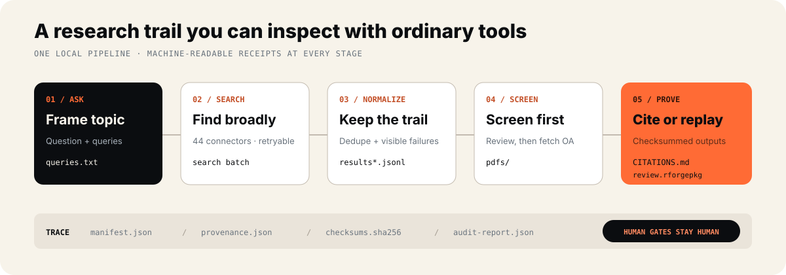

<p align="center">
  
</p>

<p align="center">
  <a href="https://github.com/TrebuchetDynamics/research-forge/releases/latest"></a>
  <a href="https://github.com/TrebuchetDynamics/research-forge/actions/workflows/ci.yml"></a>
  <a href="https://github.com/TrebuchetDynamics/research-forge/actions/workflows/playwright-e2e.yml"></a>
  <a href="https://pkg.go.dev/github.com/TrebuchetDynamics/research-forge"></a>
  <a href="./LICENSE"></a>
</p>

<p align="center">
  <a href="#quick-start">Quick start</a> ·
  <a href="#choose-your-workflow">Choose a workflow</a> ·
  <a href="#source-coverage">Sources</a> ·
  <a href="#use-it-from-an-agent">Agent skill</a> ·
  <a href="#trust-boundaries">Trust</a>
</p>

**ResearchForge** is a local-first CLI for literature discovery and reproducible reviews. It searches scholarly sources, normalizes and deduplicates records, keeps failures visible, retrieves legal open-access files, builds citations, and packages attributable work for audit or replay.

Use a **research directory** for fast literature scouting. Use a guided **forge project** when screening, extraction, analysis, and export decisions must be attributable.

## Proof, not promises

A tracked run in this repository used **6 queries across 4 sources** and produced **280 records, 237 deduplicated records, and 10 preserved failures**. Inspect the real [`manifest.json`](./research/open-source-project-search/manifest.json); these are repository artifacts, not adoption or performance claims.

Every batch search leaves an ordinary directory behind:

```text
research/my-topic/
├── manifest.json           # exact queries, sources, counts, timestamp
├── results.jsonl           # normalized records from successful sources
├── results-deduped.jsonl   # merged DOI/title identities
├── failures.jsonl          # retryable source/query failures
├── search-stats.txt        # coverage and dedupe summary
├── raw/                    # readable source/query responses
└── pdfs/                   # approved open-access downloads
```

Nothing is hidden in a hosted dashboard. Review the JSONL, version it, diff it, retry it, or hand it to another tool.

## Quick start

### 1. Install

```sh
curl -fsSL \
  https://raw.githubusercontent.com/TrebuchetDynamics/research-forge/main/install.sh | bash
```

Prebuilt binaries support Linux, macOS, and Windows. To build from source (Go 1.26+):

```sh
go install github.com/TrebuchetDynamics/research-forge/cmd/rforge@latest
```

### 2. Search two reliable starter sources

```sh
rforge search batch --out ./research/my-topic \
  --query "prediction markets information aggregation" \
  --sources openalex,arxiv --stats
```

### 3. Build a bibliography

```sh
rforge citations build --research-dir ./research
```

You now have normalized records, a deduplicated set, a failure queue, a manifest, statistics, and `research/CITATIONS.md`. After title/abstract screening, fetch legal open-access files for included papers:

```sh
rforge oa fetch --dir ./research/my-topic
```

## How the evidence trail works

<p align="center">
  
</p>

ResearchForge automates **reversible work**: retrieval, normalization, deduplication, retry queues, provenance checks, and package audits. Humans still approve inclusion/exclusion, full-text acquisition, accepted extraction, analysis methods, final claims, and package export.

## Choose your workflow

| If you need to… | Start here |
|---|---|
| Scout a topic quickly | `rforge search batch` with `openalex,arxiv` |
| Maintain a living search | `search stats`, targeted `search resume`, and `search refresh` |
| Run an attributable review | `project create` + `forge init` |
| Audit or replay a review package | `package audit` / `package replay` |
| Let an agent research with guardrails | Install the [ResearchForge skill](#use-it-from-an-agent) |

## Keep a topic reproducible

Put one query per line in `queries.txt`, then search several sources in one transaction:

```sh
rforge search batch --out ./research/market-design \
  --queries queries.txt \
  --sources openalex,arxiv,crossref,semantic-scholar \
  --continue-on-error --stats
```

### Inspect, retry, refresh, and validate deliberately

```sh
# Inspect current source coverage and dedupe statistics
rforge search stats --dir ./research/market-design

# Preview failed-query retries without using the network
rforge search resume \
  --failures ./research/market-design/failures.jsonl \
  --out ./research/market-design --dry-run

# Replay the stored manifest and report new / unchanged / gone records
rforge search refresh --dir ./research/market-design --dry-run
rforge search refresh --dir ./research/market-design

# Validate a versioned agent-authored receipt
rforge provenance validate ./research/market-design/provenance.json
```

Provenance schema v1 requires an exact depth (`quick`, `standard`, or `comprehensive`), normalized `rforge_version` data, required fields, and string-only errors.

## When a search becomes a review

Create a guided project when decisions and analysis must be replayable by another reviewer:

```sh
rforge project create ./my-review --title "High entropy superconductors"

rforge forge init --project ./my-review \
  --question "What outcomes are reported for high entropy superconductors?"

rforge forge status --project ./my-review
rforge forge next --project ./my-review
```

The state machine covers source planning, import and dedupe, legal acquisition, parser arbitration, screening, evidence extraction, analysis, reporting, privacy review, and export. Review packages include checksums, provenance, redaction records, and offline audit/replay commands:

```sh
rforge package audit  ./review.rforgepkg
rforge package replay ./review.rforgepkg
```

See the [reproducible review package specification](./docs/reproducible-review-package.md) for required files and human gates.

## Source coverage

`search batch` supports **44 connectors**. Start narrow; broad sweeps are slower and more exposed to upstream quotas.

| Preset | Good for |
|---|---|
| `openalex,arxiv` | Fast general discovery |
| `scholarly-fast` | OpenAlex + arXiv + Crossref |
| `openalex,arxiv,semantic-scholar` | Citation-oriented AI/CS research |
| `biomedical` | PubMed + Europe PMC + bioRxiv |
| `preprints` | arXiv + bioRxiv + medRxiv + ChemRxiv |
| `open` | Open-access sources |
| `all` | Every keyword-search connector; expect partial failures |

Run `rforge doctor` before a large sweep. It reports optional configuration such as `RFORGE_SEMANTIC_SCHOLAR_API_KEY`, whose absence can cause HTTP 429 responses. For machine-readable command discovery, run `rforge help --json`.

## Use it from an agent

The repository ships one retrieval-first skill at [`skills/research-forge/SKILL.md`](./skills/research-forge/SKILL.md). The skill defines source breadth, provenance requirements, legal-acquisition boundaries, and human approval gates; it never authorizes an agent to approve screening, extraction, final claims, or package export.

**DeepSeek Harness and other shared-agent consumers:**

```sh
mkdir -p ~/.agents/skills/research-forge
curl -fsSL \
  https://raw.githubusercontent.com/TrebuchetDynamics/research-forge/main/skills/research-forge/SKILL.md \
  > ~/.agents/skills/research-forge/SKILL.md
```

**Claude:**

```sh
mkdir -p ~/.claude/skills/research-forge
curl -fsSL \
  https://raw.githubusercontent.com/TrebuchetDynamics/research-forge/main/skills/research-forge/SKILL.md \
  > ~/.claude/skills/research-forge/SKILL.md
```

Then ask: **“Use the research-forge skill to research: `<your question>`.”** The skill calls the standalone `rforge` CLI; no harness-specific plugin or product fork is required.

## Trust boundaries

- **Open access is explicit.** `oa fetch` distinguishes `oa_unavailable` from download failures; paywall-bypass sources are unsupported.
- **Failures stay visible.** Rate limits, timeouts, and source/query failures remain in `failures.jsonl` for deliberate retry.
- **Research claims remain human-owned.** Retrieval and checks can be automated; scientific approval cannot.
- **Shareable packages are reviewed.** Secrets, private paths, and restricted full text are blocked or redacted before export.
- **Local-first means inspectable.** Core workflows use the CLI and machine-readable files; the Go + HTMX web UI is optional.

## Documentation and development

- [Reproducible review package specification](./docs/reproducible-review-package.md)
- [Product requirements](./RESEARCH-FORGE-PRD.md)
- [Roadmap](./ROADMAP.md)
- [Skill catalog](./SKILLS.md)
- [Contributing guide](./CONTRIBUTING.md)
- [Release downloads](https://github.com/TrebuchetDynamics/research-forge/releases)

```sh
git clone https://github.com/TrebuchetDynamics/research-forge.git
cd research-forge
make check
```

ResearchForge uses Go, SQLite, a Go + HTMX local UI, deterministic fixtures, and test-first development.

## License

[MIT](./LICENSE) © 2026 Trebuchet Dynamics.
